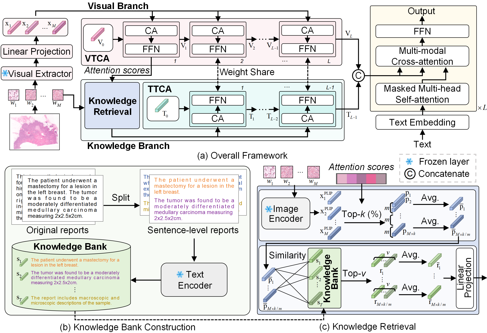

# Historical report guided bi-modal concurrent learning for pathology report generation [MICCAI2025 oral, Best Computational Pathology Paper]

=====
<details>
<summary>
    <b>Historical report guided bi-modal concurrent learning for pathology report generation</b>.
      <a href="https://link.springer.com/chapter/10.1007/978-3-032-04978-0_33" target="blank">[Link]</a>
      <br><em>Ling Zhang, Boxiang Yun, Qingli Li, Yan Wang </em></br>
</summary>
</details>
 <b>Summary:</b> We propose a Historical Report Guided Bi-modal Concurrent Learning Framework for Pathology Report Generation (BiGen) emulating pathologists’ diagnostic reasoning (we provide the knowledge bank file, captions, WSI features with <a href="https://github.com/mahmoodlab/UNI" target="blank"><b>UNI</b></a> as the extractor in the link <a href="https://drive.google.com/drive/folders/1zTtBnSfP1ZxUbVLrAZBL51cbFkYNPGT5?usp=sharing" target="blank"><b>data1</b></a> and WSI features with <a href="https://github.com/PathologyFoundation/plip" target="blank"><b>PLIP</b></a>  as the extractor in the link <a href="https://drive.google.com/drive/folders/11djn3S9rVfU6ol9RRNnGkUNzxZhBK7ZJ" target="blank"><b>data2</b></a>.) By incorporating the visual and knowledge branch module, our method is able to provide WSI-relevant rich semantic content and suppress information redundancy in WSIs.



## Pre-requisites:
The Slide-Text captions were from PathText, which was collected by <a href="https://link.springer.com/chapter/10.1007/978-3-031-72083-3_51" target="blank"><b>WsiCaption</b></a>

### Downloading TCGA Slides
To download diagnostic WSIs (formatted as .svs files), please refer to the [NIH Genomic Data Commons Data Portal](https://portal.gdc.cancer.gov/). WSIs for each cancer type can be downloaded using the [GDC Data Transfer Tool](https://docs.gdc.cancer.gov/Data_Transfer_Tool/Users_Guide/Data_Download_and_Upload/).

### Processing Whole Slide Images
To process WSIs, first, the tissue regions in each biopsy slide are segmented using Otsu's Segmentation on a downsampled WSI using OpenSlide. The 256 x 256 patches without spatial overlapping are extracted from the segmented tissue regions at 10x magnification. Consequently, <a href="https://github.com/mahmoodlab/UNI" target="blank"><b>UNI</b></a> is used to encode raw image patches into 1024-dim feature vectors, which we then save as .pt files for each WSI. We achieve the pre-processing of WSIs by using <a href="https://github.com/mahmoodlab/CLAM" target="blank"><b>CLAM</b></a>

## Running Experiments
Experiments can be run using the following generic command-line (These codes are modified on <a href="https://github.com/cpystan/Wsi-Caption" target="blank"><b>WsiCaption</b></a>):
### Training model
```shell
python main.py --mode 'Train' --n_gpu <GPUs to be used> --image_dir <SLIDE FEATURE PATH USING UNI> --image_dir_plip <SLIDE FEATURE PATH  USING PLIP> --ann_path <CAPTION PATH>--split_path <PATH to the directory containing the train/val/test splits> --bank_path <KNOWLEDGE BANK PATH> --save_dir <SAVING CKPT PATH>
```
### Testing model
```shell
python main.py --mode 'Test' --image_dir <SLIDE FEATURE PATH USING UNI> --image_dir_plip <SLIDE FEATURE PATH  USING PLIP> --ann_path <CAPTION PATH>--split_path <PATH to the directory containing the train/val/test splits> --bank_path <KNOWLEDGE BANK PATH> --checkpoint_dir <PATH TO CKPT> --save_dir <PATH TO SAVING RESULTS>
```

## Basic Environment
* Linux (Tested on Ubuntu 20.04.6 LTS (Focal Fossa)) 
* NVIDIA GPU (Tested on Nvidia GeForce A40) with CUDA 12.1
* Python (3.8)

